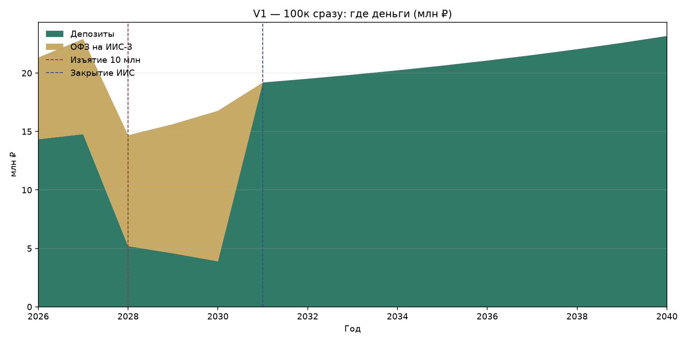
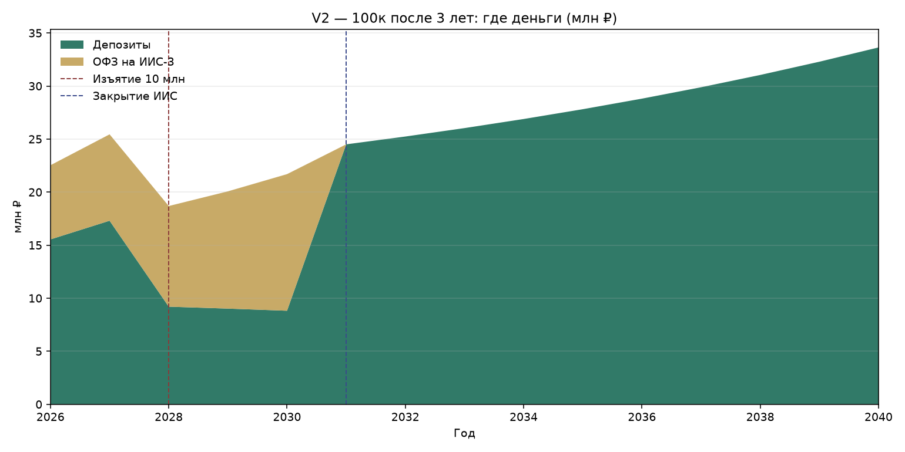
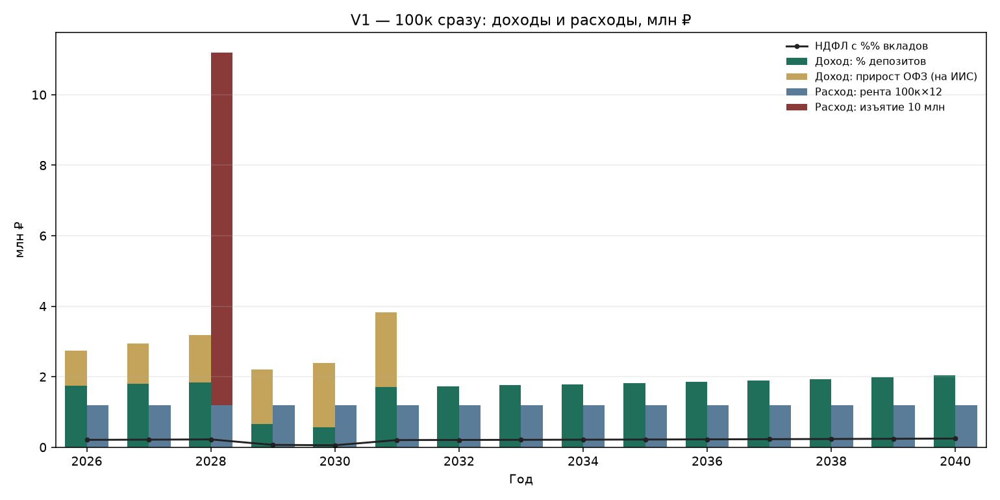
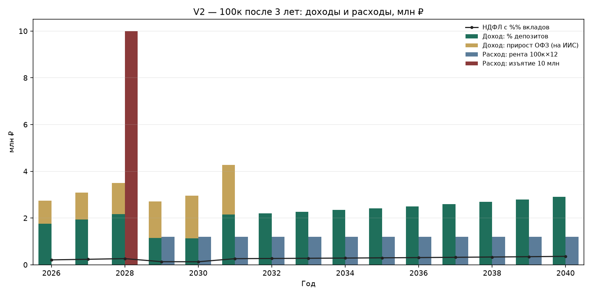
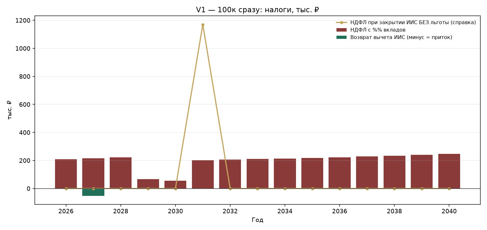
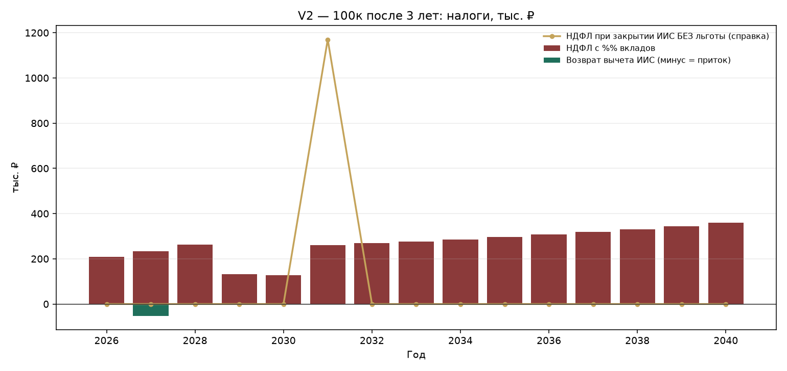

# Кэшфлоу по сценариям

По каждому сценарию — **отдельная страница**: графики + таблицы «где деньги / ставки / доходы / расходы / налоги» год за годом.

| Сценарий | Суть | Отчёт | CSV |
| --- | --- | --- | --- |
| **V1** | 100к/мес **сразу** + 10 млн через 3 года | [CASHFLOW_V1.md](CASHFLOW_V1.md) | [v1_rent_now.csv](../data/v1_rent_now.csv) |
| **V2** | 100к/мес **после 3 лет** + 10 млн через 3 года | [CASHFLOW_V2.md](CASHFLOW_V2.md) | [v2_rent_after_3y.csv](../data/v2_rent_after_3y.csv) |

## Что в таблицах каждого сценария

1. **Где деньги** — депозиты vs ОФЗ на ИИС-3, ставки  
2. **Доходы / расходы** — % по вкладам, прирост ОФЗ, рента, изъятие 10 млн, нетто-кэш  
3. **Налоги** — НДФЛ с %% вкладов (сверх 1 млн × ключ 14%), возврат вычета ИИС, справка НДФЛ при закрытии ИИС без льготы  

```bash
python3 scripts/cashflow_yearly.py
```

## Сравнение кратко

| | V1 сразу | V2 после 3 лет |
| --- | ---: | ---: |
| Рента 2026–2028 | 100к/мес | 0 |
| Депозиты после −10 млн (с учётом НДФЛ) | ~5,2 млн | ~9,2 млн |
| 2029–2030 | сильное проедание тела | тонкая/отриц. подушка после НДФЛ |
| После закрытия ИИС 2031 | выравнивается | выравнивается |
| Относительно лучше | — | **V2** |

### Капитал





### Доходы и расходы





### Налоги




