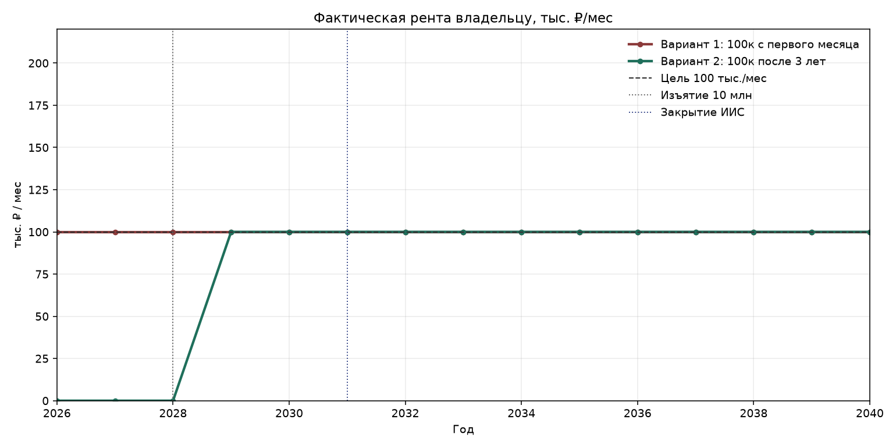
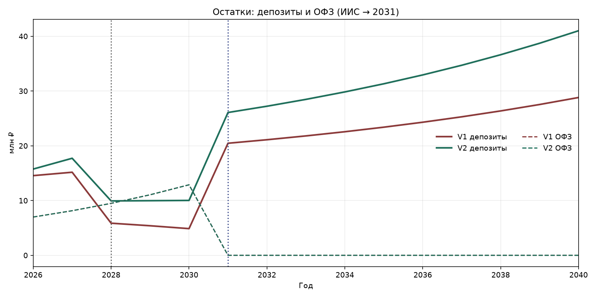
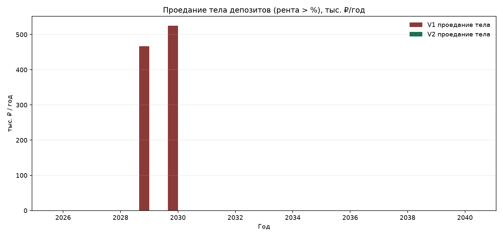
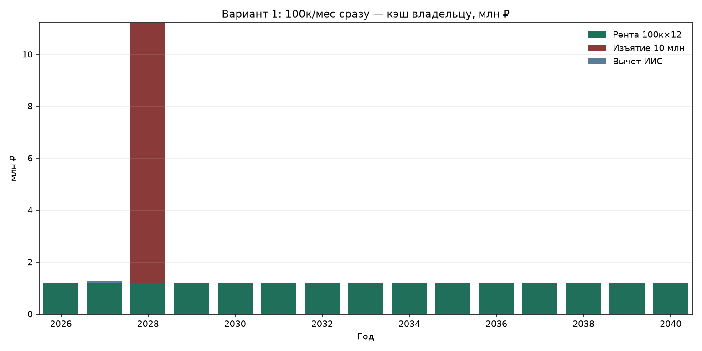
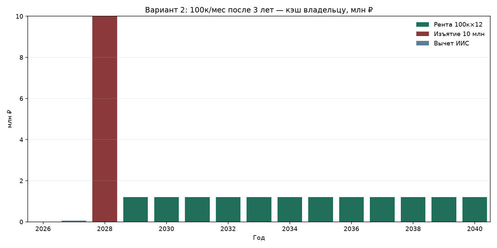
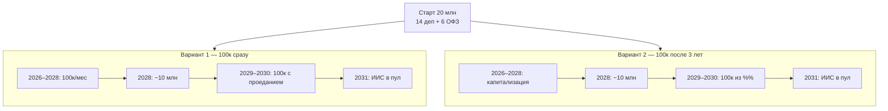

# Детальный кэшфлоу: два варианта ренты 100 тыс. ₽/мес

База: **14 млн** депозиты + **6 млн** ОФЗ на ИИС-3.  
Разовое изъятие **10 млн** — конец **2028**. Закрытие ИИС — **2031**.

| Параметр | Значение |
| --- | ---: |
| Рента на расходы | **100 000 ₽/мес** (= 1,2 млн ₽/год) |
| Ставка депозитов 2026–2030 | 12,5% |
| Ставка с 2031 | 9,0% |
| YTM ОФЗ на ИИС | 16,5% |

```bash
python3 scripts/cashflow_yearly.py
```

---

## Короткий вывод

| | Вариант 1: 100к сразу | Вариант 2: 100к после 3 лет |
| --- | --- | --- |
| Рента 2026–2028 | 100к/мес | 0 (капитализация) |
| Депозиты после −10 млн (конец 2028) | **5 864 844** | **9 933 594** |
| 2029–2030 | 100к только с **проеданием тела** | 100к **из процентов**, тело цело |
| 2031+ после ИИС | ≈100 000/мес | ≈100 000/мес |
| Без дыр до 2040 | ❌ | ✅ рекомендуемый |

Почему старая модель «не верилась»: в ней в 2026–2028 рента на расходы **не вычиталась** из депозитов. Ниже оба варианта считаются с реальным съёмом 100к/мес.







---

## Вариант 1 — 100 тыс./мес с первого месяца

С депозитов каждый год уходит **1,2 млн**. В конце 2028 ещё **−10 млн**.



| Год | Фаза | Ставка % | Деп. конец | ОФЗ конец | Рента ₽/мес | Проедание тела/год | Изъятие | Капитал | ≥100к |
| ---: | ---: | ---: | ---: | ---: | ---: | ---: | ---: | ---: | ---: |
| 2026 | рента 100к/мес | 12.5 | 14 550 000 | 6 990 000 | 100 000 | 0 | 0 | 21 540 000 | ✅ |
| 2027 | рента 100к/мес | 12.5 | 15 168 750 | 8 143 350 | 100 000 | 0 | 0 | 23 312 100 | ✅ |
| 2028 | изъятие 10 млн + рента | 12.5 | 5 864 844 | 9 487 003 | 100 000 | 0 | 10 000 000 | 15 351 846 | ✅ |
| 2029 | рента до закрытия ИИС | 12.5 | 5 397 949 | 11 052 358 | 100 000 | 466 895 | 0 | 16 450 307 | ❌ |
| 2030 | рента до закрытия ИИС | 12.5 | 4 872 693 | 12 875 997 | 100 000 | 525 256 | 0 | 17 748 690 | ❌ |
| 2031 | закрытие ИИС + рента | 9.0 | 20 461 820 | 0 | 100 000 | 0 | 0 | 20 461 820 | ✅ |
| 2032 | рента объединённая | 9.0 | 21 103 384 | 0 | 100 000 | 0 | 0 | 21 103 384 | ✅ |
| 2033 | рента объединённая | 9.0 | 21 802 689 | 0 | 100 000 | 0 | 0 | 21 802 689 | ✅ |
| 2034 | рента объединённая | 9.0 | 22 564 931 | 0 | 100 000 | 0 | 0 | 22 564 931 | ✅ |
| 2035 | рента объединённая | 9.0 | 23 395 775 | 0 | 100 000 | 0 | 0 | 23 395 775 | ✅ |
| 2036 | рента объединённая | 9.0 | 24 301 394 | 0 | 100 000 | 0 | 0 | 24 301 394 | ✅ |
| 2037 | рента объединённая | 9.0 | 25 288 520 | 0 | 100 000 | 0 | 0 | 25 288 520 | ✅ |
| 2038 | рента объединённая | 9.0 | 26 364 487 | 0 | 100 000 | 0 | 0 | 26 364 487 | ✅ |
| 2039 | рента объединённая | 9.0 | 27 537 290 | 0 | 100 000 | 0 | 0 | 27 537 290 | ✅ |
| 2040 | рента объединённая | 9.0 | 28 815 647 | 0 | 100 000 | 0 | 0 | 28 815 647 | ✅ |

### Что происходит

1. На 14 млн @12,5% проценты ≈ 145,8 тыс./мес — **100к тянем**, остаток %% капитализируется.
2. К изъятию на депозитах ≈ **15 864 844** → после −10 млн остаётся ≈ **5 864 844**.
3. С ~5,9 млн проценты дают только ≈ **61 тыс./мес**. Чтобы продолжать 100к, модель **режет тело** (см. колонку «Проедание»).
4. К концу 2030 депозиты ≈ **4 872 693**.
5. В 2031 ОФЗ вливаются в пул — снова можно снимать 100к без аварии.

Годы, где цель формально бьётся только через проедание / где есть дыра: **2029, 2030**.

Чтобы забирать 100к сразу *и* не проедать тело до 2031, разовое изъятие должно быть не 10 млн, а примерно **6,0–6,5 млн**.

---

## Вариант 2 — 100 тыс./мес только после 3 лет

2026–2028 проценты **не трогаем**. Конец 2028: −10 млн. С 2029: 100к/мес с остатка ≈9,93 млн (%% ≈103,5 тыс./мес).



| Год | Фаза | Ставка % | Деп. конец | ОФЗ конец | Рента ₽/мес | Проедание тела/год | Изъятие | Капитал | ≥100к |
| ---: | ---: | ---: | ---: | ---: | ---: | ---: | ---: | ---: | ---: |
| 2026 | накопление (рента 0) | 12.5 | 15 750 000 | 6 990 000 | 0 | 0 | 0 | 22 740 000 | ✅ |
| 2027 | накопление (рента 0) | 12.5 | 17 718 750 | 8 143 350 | 0 | 0 | 0 | 25 862 100 | ✅ |
| 2028 | изъятие 10 млн | 12.5 | 9 933 594 | 9 487 003 | 0 | 0 | 10 000 000 | 19 420 596 | ✅ |
| 2029 | рента до закрытия ИИС | 12.5 | 9 975 293 | 11 052 358 | 100 000 | 0 | 0 | 21 027 651 | ✅ |
| 2030 | рента до закрытия ИИС | 12.5 | 10 022 205 | 12 875 997 | 100 000 | 0 | 0 | 22 898 202 | ✅ |
| 2031 | закрытие ИИС + рента | 9.0 | 26 074 788 | 0 | 100 000 | 0 | 0 | 26 074 788 | ✅ |
| 2032 | рента объединённая | 9.0 | 27 221 519 | 0 | 100 000 | 0 | 0 | 27 221 519 | ✅ |
| 2033 | рента объединённая | 9.0 | 28 471 456 | 0 | 100 000 | 0 | 0 | 28 471 456 | ✅ |
| 2034 | рента объединённая | 9.0 | 29 833 887 | 0 | 100 000 | 0 | 0 | 29 833 887 | ✅ |
| 2035 | рента объединённая | 9.0 | 31 318 937 | 0 | 100 000 | 0 | 0 | 31 318 937 | ✅ |
| 2036 | рента объединённая | 9.0 | 32 937 641 | 0 | 100 000 | 0 | 0 | 32 937 641 | ✅ |
| 2037 | рента объединённая | 9.0 | 34 702 029 | 0 | 100 000 | 0 | 0 | 34 702 029 | ✅ |
| 2038 | рента объединённая | 9.0 | 36 625 211 | 0 | 100 000 | 0 | 0 | 36 625 211 | ✅ |
| 2039 | рента объединённая | 9.0 | 38 721 480 | 0 | 100 000 | 0 | 0 | 38 721 480 | ✅ |
| 2040 | рента объединённая | 9.0 | 41 006 413 | 0 | 100 000 | 0 | 0 | 41 006 413 | ✅ |

Провалы после старта ренты: **нет**.

---

## Водопад



---

## Файлы

| Файл | Содержание |
| --- | --- |
| [cashflow_v1_rent_now.csv](../data/cashflow_v1_rent_now.csv) | Вариант 1 |
| [cashflow_v2_rent_after_3y.csv](../data/cashflow_v2_rent_after_3y.csv) | Вариант 2 |
| [charts/](charts/) | PNG |

*Модель иллюстративная, не ИИР.*
