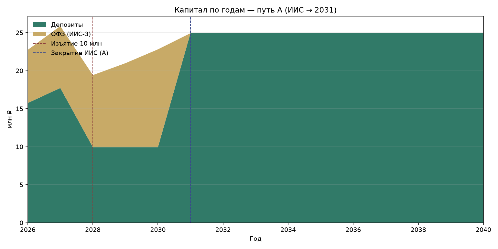
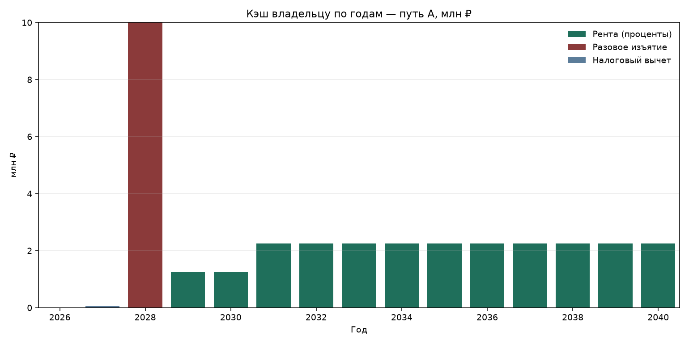
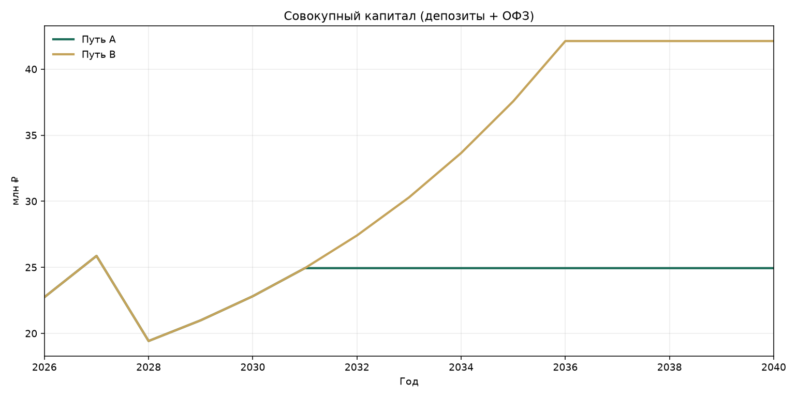
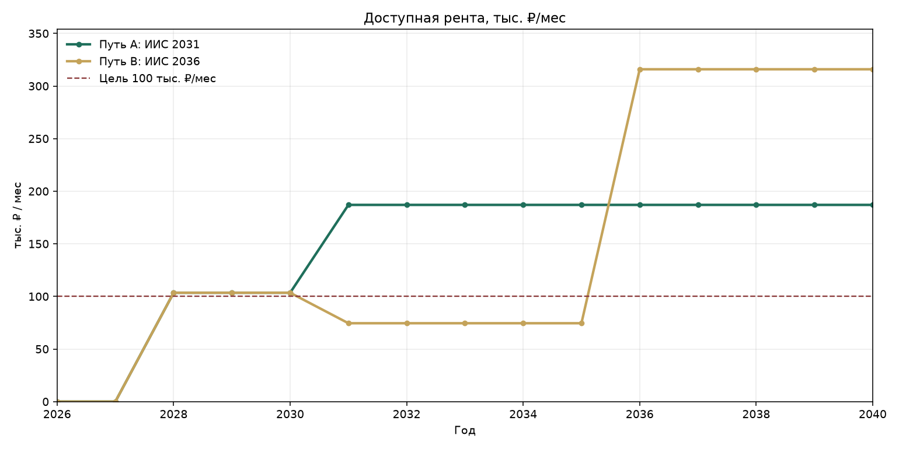
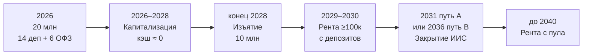

# Детальный кэшфлоу по годам (2026–2040)

Сценарий **«план»**: **14 млн** депозиты + **6 млн** длинные ОФЗ на ИИС-3.

| Параметр | Значение |
| --- | ---: |
| Ставка депозитов 2026–2030 | **12,5%** |
| Ставка ренты с 2031 | **9,0%** (гипотеза нормализации) |
| YTM ОФЗ (реинвест на ИИС) | **16,5%** |
| Изъятие **10 млн** | конец **2028** (после 3 лет капитализации) |
| Цель ренты | ≥ **100 000 ₽/мес** с **2029** |
| Вычет ИИС (оценка) | **52 000 ₽** в **2027** |

Пересчёт графиков и CSV:

```bash
python3 scripts/cashflow_yearly.py
```

---

## Путь A — закрытие ИИС в 2031 (основной)





### Сводка год за годом

| Год | Фаза | Ставка % | Деп. конец | ОФЗ конец | Капитал | Рента ₽/мес | Кэш владельцу | ≥100к |
| ---: | ---: | ---: | ---: | ---: | ---: | ---: | ---: | ---: |
| 2026 | накопление | 12.5 | 15 750 000 | 6 990 000 | 22 740 000 | 0 | 0 | ✅ |
| 2027 | накопление | 12.5 | 17 718 750 | 8 143 350 | 25 862 100 | 0 | 52 000 | ✅ |
| 2028 | конец накопления / изъятие | 12.5 | 9 933 594 | 9 487 003 | 19 420 596 | 103 475 | 10 000 000 | ✅ |
| 2029 | рента до закрытия ИИС | 12.5 | 9 933 594 | 11 052 358 | 20 985 952 | 103 475 | 1 241 699 | ✅ |
| 2030 | рента до закрытия ИИС | 12.5 | 9 933 594 | 12 875 997 | 22 809 591 | 103 475 | 1 241 699 | ✅ |
| 2031 | закрытие ИИС | 9.0 | 24 934 131 | 0 | 24 934 131 | 187 006 | 2 244 072 | ✅ |
| 2032 | рента объединённая | 9.0 | 24 934 131 | 0 | 24 934 131 | 187 006 | 2 244 072 | ✅ |
| 2033 | рента объединённая | 9.0 | 24 934 131 | 0 | 24 934 131 | 187 006 | 2 244 072 | ✅ |
| 2034 | рента объединённая | 9.0 | 24 934 131 | 0 | 24 934 131 | 187 006 | 2 244 072 | ✅ |
| 2035 | рента объединённая | 9.0 | 24 934 131 | 0 | 24 934 131 | 187 006 | 2 244 072 | ✅ |
| 2036 | рента объединённая | 9.0 | 24 934 131 | 0 | 24 934 131 | 187 006 | 2 244 072 | ✅ |
| 2037 | рента объединённая | 9.0 | 24 934 131 | 0 | 24 934 131 | 187 006 | 2 244 072 | ✅ |
| 2038 | рента объединённая | 9.0 | 24 934 131 | 0 | 24 934 131 | 187 006 | 2 244 072 | ✅ |
| 2039 | рента объединённая | 9.0 | 24 934 131 | 0 | 24 934 131 | 187 006 | 2 244 072 | ✅ |
| 2040 | рента объединённая | 9.0 | 24 934 131 | 0 | 24 934 131 | 187 006 | 2 244 072 | ✅ |

### Разложение потоков

| Год | Деп. старт | % за год | Изъятие | Деп. конец | ОФЗ старт | Рост ОФЗ | ОФЗ конец | Вычет | Рента/год |
| ---: | ---: | ---: | ---: | ---: | ---: | ---: | ---: | ---: | ---: |
| 2026 | 14 000 000 | 1 750 000 | 0 | 15 750 000 | 6 000 000 | 990 000 | 6 990 000 | 0 | 0 |
| 2027 | 15 750 000 | 1 968 750 | 0 | 17 718 750 | 6 990 000 | 1 153 350 | 8 143 350 | 52 000 | 0 |
| 2028 | 17 718 750 | 2 214 844 | 10 000 000 | 9 933 594 | 8 143 350 | 1 343 653 | 9 487 003 | 0 | 0 |
| 2029 | 9 933 594 | 1 241 699 | 0 | 9 933 594 | 9 487 003 | 1 565 355 | 11 052 358 | 0 | 1 241 699 |
| 2030 | 9 933 594 | 1 241 699 | 0 | 9 933 594 | 11 052 358 | 1 823 639 | 12 875 997 | 0 | 1 241 699 |
| 2031 | 9 933 594 | 2 244 072 | 0 | 24 934 131 | 12 875 997 | 2 124 540 | 0 | 0 | 2 244 072 |
| 2032 | 24 934 131 | 2 244 072 | 0 | 24 934 131 | 0 | 0 | 0 | 0 | 2 244 072 |
| 2033 | 24 934 131 | 2 244 072 | 0 | 24 934 131 | 0 | 0 | 0 | 0 | 2 244 072 |
| 2034 | 24 934 131 | 2 244 072 | 0 | 24 934 131 | 0 | 0 | 0 | 0 | 2 244 072 |
| 2035 | 24 934 131 | 2 244 072 | 0 | 24 934 131 | 0 | 0 | 0 | 0 | 2 244 072 |
| 2036 | 24 934 131 | 2 244 072 | 0 | 24 934 131 | 0 | 0 | 0 | 0 | 2 244 072 |
| 2037 | 24 934 131 | 2 244 072 | 0 | 24 934 131 | 0 | 0 | 0 | 0 | 2 244 072 |
| 2038 | 24 934 131 | 2 244 072 | 0 | 24 934 131 | 0 | 0 | 0 | 0 | 2 244 072 |
| 2039 | 24 934 131 | 2 244 072 | 0 | 24 934 131 | 0 | 0 | 0 | 0 | 2 244 072 |
| 2040 | 24 934 131 | 2 244 072 | 0 | 24 934 131 | 0 | 0 | 0 | 0 | 2 244 072 |

### Смысл по годам

| Год | Кэш владельцу | Портфель |
| --- | --- | --- |
| 2026 | 0 | Старт 14+6; капитализация |
| 2027 | ~52 тыс. вычет | Капитализация |
| 2028 | **10 млн** изъятие | Деп. ≈19,93 → **9,93 млн** остаток; потенциал ренты ≈**103,5 тыс./мес** |
| 2029–2030 | ≈103,5 тыс./мес с депозитов @12,5% | ОФЗ растут на ИИС |
| 2031 | закрытие ИИС в начале года | ОФЗ (~15,0 млн после роста) → в пул; рента ≈**187 тыс./мес** @9% |
| 2032–2040 | ≈**187 тыс./мес** при 9% | Цель с запасом |

---

## Путь B — закрытие ИИС в 2036





### Сводка год за годом

| Год | Фаза | Ставка % | Деп. конец | ОФЗ конец | Капитал | Рента ₽/мес | Кэш владельцу | ≥100к |
| ---: | ---: | ---: | ---: | ---: | ---: | ---: | ---: | ---: |
| 2026 | накопление | 12.5 | 15 750 000 | 6 990 000 | 22 740 000 | 0 | 0 | ✅ |
| 2027 | накопление | 12.5 | 17 718 750 | 8 143 350 | 25 862 100 | 0 | 52 000 | ✅ |
| 2028 | конец накопления / изъятие | 12.5 | 9 933 594 | 9 487 003 | 19 420 596 | 103 475 | 10 000 000 | ✅ |
| 2029 | рента до закрытия ИИС | 12.5 | 9 933 594 | 11 052 358 | 20 985 952 | 103 475 | 1 241 699 | ✅ |
| 2030 | рента до закрытия ИИС | 12.5 | 9 933 594 | 12 875 997 | 22 809 591 | 103 475 | 1 241 699 | ✅ |
| 2031 | рента до закрытия ИИС | 9.0 | 9 933 594 | 15 000 537 | 24 934 131 | 74 502 | 894 023 | ❌ |
| 2032 | рента до закрытия ИИС | 9.0 | 9 933 594 | 17 475 625 | 27 409 219 | 74 502 | 894 023 | ❌ |
| 2033 | рента до закрытия ИИС | 9.0 | 9 933 594 | 20 359 104 | 30 292 697 | 74 502 | 894 023 | ❌ |
| 2034 | рента до закрытия ИИС | 9.0 | 9 933 594 | 23 718 356 | 33 651 949 | 74 502 | 894 023 | ❌ |
| 2035 | рента до закрытия ИИС | 9.0 | 9 933 594 | 27 631 884 | 37 565 478 | 74 502 | 894 023 | ❌ |
| 2036 | закрытие ИИС | 9.0 | 42 124 739 | 0 | 42 124 739 | 315 936 | 3 791 227 | ✅ |
| 2037 | рента объединённая | 9.0 | 42 124 739 | 0 | 42 124 739 | 315 936 | 3 791 227 | ✅ |
| 2038 | рента объединённая | 9.0 | 42 124 739 | 0 | 42 124 739 | 315 936 | 3 791 227 | ✅ |
| 2039 | рента объединённая | 9.0 | 42 124 739 | 0 | 42 124 739 | 315 936 | 3 791 227 | ✅ |
| 2040 | рента объединённая | 9.0 | 42 124 739 | 0 | 42 124 739 | 315 936 | 3 791 227 | ✅ |

**Разрыв цели в пути B:** 2031–2035 — при ставке 9% рента только с депозитного остатка (~74,5 тыс. ₽/мес) ниже 100 тыс. Путь B оправдан, если короткие вклады останутся ≳12,5%, либо изъятие меньше 10 млн, либо ИИС закрывают раньше (**путь A**).

---

## Водопад



---

## Файлы

| Файл | Содержание |
| --- | --- |
| [data/cashflow_base.csv](../data/cashflow_base.csv) | Путь A |
| [data/cashflow_hold.csv](../data/cashflow_hold.csv) | Путь B |
| [plan/charts/](charts/) | PNG |

*Модель иллюстративная, не ИИР.*
