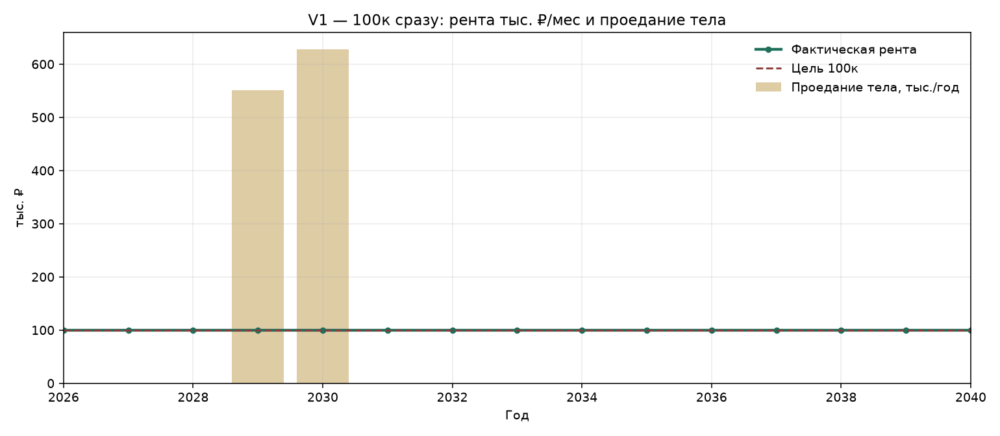

# Сценарий V1 — рента 100 тыс./мес с первого месяца

Снимаем **100 000 ₽ каждый месяц** сразу. Через 3 года дополнительно забираем **10 млн**. ОФЗ до 2031 сидят на ИИС-3; купоны/рост там же (кэшем не приходят).

## Параметры сценария

| Параметр | Значение |
| --- | ---: |
| Старт депозиты | 14 000 000 |
| Старт ОФЗ на ИИС-3 | 6 000 000 |
| Рента | 100 000/мес = 1 200 000/год |
| Изъятие | 10 000 000 в конце 2028 |
| Закрытие ИИС | 2031 |
| Ставка вкладов 2026–2030 / с 2031 | 12,5% / 9% |
| YTM ОФЗ | 16,5% |
| НДФЛ с %% вкладов | 13% с суммы сверх 140 000 (1 млн × ключ 14,00%) |
| Вычет ИИС на взнос | возврат 52 000 в 2027 |
| НДФЛ при закрытии ИИС | **0 в модели** (льгота на финрезультат); справочно — колонка «без льготы» |

Пересчёт: `python3 scripts/cashflow_yearly.py`

---

## Графики

---

## 1. Где деньги и под какой ставкой

| Год | Фаза | Где деньги на конец года | Деп. % | Деп. конец | ОФЗ YTM % | ОФЗ конец | Капитал всего | ИИС открыт |
| ---: | ---: | ---: | ---: | ---: | ---: | ---: | ---: | ---: |
| 2026 | рента 100к/мес | депозиты 14 340 700; ОФЗ на ИИС-3 6 990 000 | 12,5 | 14 340 700 | 16,5 | 6 990 000 | 21 330 700 | да |
| 2027 | рента 100к/мес | депозиты 14 770 451; ОФЗ на ИИС-3 8 143 350 | 12,5 | 14 770 451 | 16,5 | 8 143 350 | 22 913 801 | да |
| 2028 | изъятие 10 млн + рента | депозиты 5 194 938; ОФЗ на ИИС-3 9 487 003 | 12,5 | 5 194 938 | 16,5 | 9 487 003 | 14 681 940 | да |
| 2029 | рента, ИИС открыт | депозиты 4 578 087; ОФЗ на ИИС-3 11 052 358 | 12,5 | 4 578 087 | 16,5 | 11 052 358 | 15 630 445 | да |
| 2030 | рента, ИИС открыт | депозиты 3 894 154; ОФЗ на ИИС-3 12 875 997 | 12,5 | 3 894 154 | 16,5 | 12 875 997 | 16 770 151 | да |
| 2031 | закрытие ИИС + рента | депозиты 19 192 345 | 9,0 | 19 192 345 | 16,5 | 0 | 19 192 345 | нет |
| 2032 | рента, единый пул | депозиты 19 513 306 | 9,0 | 19 513 306 | 0,0 | 0 | 19 513 306 | нет |
| 2033 | рента, единый пул | депозиты 19 859 398 | 9,0 | 19 859 398 | 0,0 | 0 | 19 859 398 | нет |
| 2034 | рента, единый пул | депозиты 20 232 589 | 9,0 | 20 232 589 | 0,0 | 0 | 20 232 589 | нет |
| 2035 | рента, единый пул | депозиты 20 635 000 | 9,0 | 20 635 000 | 0,0 | 0 | 20 635 000 | нет |
| 2036 | рента, единый пул | депозиты 21 068 921 | 9,0 | 21 068 921 | 0,0 | 0 | 21 068 921 | нет |
| 2037 | рента, единый пул | депозиты 21 536 817 | 9,0 | 21 536 817 | 0,0 | 0 | 21 536 817 | нет |
| 2038 | рента, единый пул | депозиты 22 041 350 | 9,0 | 22 041 350 | 0,0 | 0 | 22 041 350 | нет |
| 2039 | рента, единый пул | депозиты 22 585 388 | 9,0 | 22 585 388 | 0,0 | 0 | 22 585 388 | нет |
| 2040 | рента, единый пул | депозиты 23 172 024 | 9,0 | 23 172 024 | 0,0 | 0 | 23 172 024 | нет |

---

## 2. Доходы, рента, изъятия

| Год | % по вкладам | Прирост ОФЗ (на ИИС) | Вычет ИИС (возврат) | Итого экономич. доход | Рента на руки/мес | Рента за год | Разовое изъятие | Кэш владельцу нетто |
| ---: | ---: | ---: | ---: | ---: | ---: | ---: | ---: | ---: |
| 2026 | 1 750 000 | 990 000 | 0 | 2 740 000 | 100 000 | 1 200 000 | 0 | 990 700 |
| 2027 | 1 792 588 | 1 153 350 | 52 000 | 2 997 938 | 100 000 | 1 200 000 | 0 | 1 037 164 |
| 2028 | 1 846 306 | 1 343 653 | 0 | 3 189 959 | 100 000 | 1 200 000 | 10 000 000 | 10 978 180 |
| 2029 | 649 367 | 1 565 355 | 0 | 2 214 723 | 100 000 | 1 200 000 | 0 | 1 133 782 |
| 2030 | 572 261 | 1 823 639 | 0 | 2 395 900 | 100 000 | 1 200 000 | 0 | 1 143 806 |
| 2031 | 1 700 522 | 2 124 540 | 0 | 3 825 062 | 100 000 | 1 200 000 | 0 | 997 132 |
| 2032 | 1 727 311 | 0 | 0 | 1 727 311 | 100 000 | 1 200 000 | 0 | 993 650 |
| 2033 | 1 756 198 | 0 | 0 | 1 756 198 | 100 000 | 1 200 000 | 0 | 989 894 |
| 2034 | 1 787 346 | 0 | 0 | 1 787 346 | 100 000 | 1 200 000 | 0 | 985 845 |
| 2035 | 1 820 933 | 0 | 0 | 1 820 933 | 100 000 | 1 200 000 | 0 | 981 479 |
| 2036 | 1 857 150 | 0 | 0 | 1 857 150 | 100 000 | 1 200 000 | 0 | 976 770 |
| 2037 | 1 896 203 | 0 | 0 | 1 896 203 | 100 000 | 1 200 000 | 0 | 971 694 |
| 2038 | 1 938 314 | 0 | 0 | 1 938 314 | 100 000 | 1 200 000 | 0 | 966 219 |
| 2039 | 1 983 722 | 0 | 0 | 1 983 722 | 100 000 | 1 200 000 | 0 | 960 316 |
| 2040 | 2 032 685 | 0 | 0 | 2 032 685 | 100 000 | 1 200 000 | 0 | 953 951 |

**Итого за 2026–2040:** рента на руки 18 000 000; разовые изъятия 10 000 000; %% вкладов начислено 25 110 906; прирост ОФЗ 9 000 537; нетто-кэш владельцу 25 060 582.

---

## 3. Налоги и устойчивость 100к

| Год | % по вкладам | Необлаг. минимум исп. | НДФЛ с %% вкладов | Возврат вычета ИИС | Финрез. ОФЗ при закрытии | НДФЛ ИИС в модели | НДФЛ ИИС без льготы* | Проедание тела | 100к без проедания |
| ---: | ---: | ---: | ---: | ---: | ---: | ---: | ---: | ---: | ---: |
| 2026 | 1 750 000 | 140 000 | 209 300 | 0 | 0 | 0 | 0 | 0 | ✅ |
| 2027 | 1 792 588 | 140 000 | 214 836 | 52 000 | 0 | 0 | 0 | 0 | ✅ |
| 2028 | 1 846 306 | 140 000 | 221 820 | 0 | 0 | 0 | 0 | 0 | ✅ |
| 2029 | 649 367 | 140 000 | 66 218 | 0 | 0 | 0 | 0 | 550 633 | ❌ |
| 2030 | 572 261 | 140 000 | 56 194 | 0 | 0 | 0 | 0 | 627 739 | ❌ |
| 2031 | 1 700 522 | 140 000 | 202 868 | 0 | 9 000 537 | 0 | 1 170 070 | 0 | ✅ |
| 2032 | 1 727 311 | 140 000 | 206 350 | 0 | 0 | 0 | 0 | 0 | ✅ |
| 2033 | 1 756 198 | 140 000 | 210 106 | 0 | 0 | 0 | 0 | 0 | ✅ |
| 2034 | 1 787 346 | 140 000 | 214 155 | 0 | 0 | 0 | 0 | 0 | ✅ |
| 2035 | 1 820 933 | 140 000 | 218 521 | 0 | 0 | 0 | 0 | 0 | ✅ |
| 2036 | 1 857 150 | 140 000 | 223 230 | 0 | 0 | 0 | 0 | 0 | ✅ |
| 2037 | 1 896 203 | 140 000 | 228 306 | 0 | 0 | 0 | 0 | 0 | ✅ |
| 2038 | 1 938 314 | 140 000 | 233 781 | 0 | 0 | 0 | 0 | 0 | ✅ |
| 2039 | 1 983 722 | 140 000 | 239 684 | 0 | 0 | 0 | 0 | 0 | ✅ |
| 2040 | 2 032 685 | 140 000 | 246 049 | 0 | 0 | 0 | 0 | 0 | ✅ |

\*«Без льготы» — справочная величина, если вычет на финрезультат ИИС-3 не применить. В основной модели налог при закрытии = 0.

НДФЛ с %% вкладов суммарно: **2 991 418**. Возврат вычета ИИС: **52 000**.

Годы, где 100к/мес не держатся без проедания тела: **2029, 2030**.

---

## CSV

Полная таблица: [`data/v1_rent_now.csv`](../data/v1_rent_now.csv)
