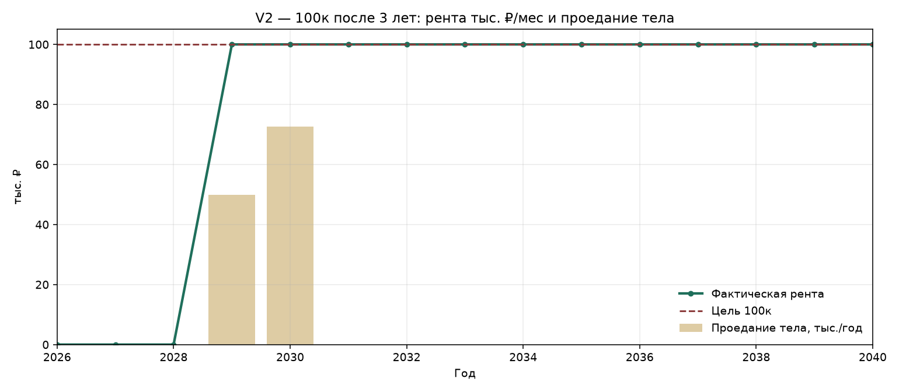

# Сценарий V2 — рента 100 тыс./мес после 3 лет

Первые **3 года** проценты по вкладам капитализируем (рента 0). В конце 2028 забираем **10 млн**, с 2029 снимаем **100 000 ₽/мес**. ОФЗ на ИИС-3 до 2031.

## Параметры сценария

| Параметр | Значение |
| --- | ---: |
| Старт депозиты | 14 000 000 |
| Старт ОФЗ на ИИС-3 | 6 000 000 |
| Рента | 100 000/мес = 1 200 000/год |
| Изъятие | 10 000 000 в конце 2028 |
| Закрытие ИИС | 2031 |
| Ставка вкладов 2026–2030 / с 2031 | 12,5% / 9% |
| YTM ОФЗ | 16,5% |
| НДФЛ с %% вкладов | 13% с суммы сверх 140 000 (1 млн × ключ 14,00%) |
| Вычет ИИС на взнос | возврат 52 000 в 2027 |
| НДФЛ при закрытии ИИС | **0 в модели** (льгота на финрезультат); справочно — колонка «без льготы» |

Пересчёт: `python3 scripts/cashflow_yearly.py`

---

## Графики

---

## 1. Где деньги и под какой ставкой

| Год | Фаза | Где деньги на конец года | Деп. % | Деп. конец | ОФЗ YTM % | ОФЗ конец | Капитал всего | ИИС открыт |
| ---: | ---: | ---: | ---: | ---: | ---: | ---: | ---: | ---: |
| 2026 | накопление | депозиты 15 540 700; ОФЗ на ИИС-3 6 990 000 | 12,5 | 15 540 700 | 16,5 | 6 990 000 | 22 530 700 | да |
| 2027 | накопление | депозиты 17 300 951; ОФЗ на ИИС-3 8 143 350 | 12,5 | 17 300 951 | 16,5 | 8 143 350 | 25 444 301 | да |
| 2028 | изъятие 10 млн | депозиты 9 200 630; ОФЗ на ИИС-3 9 487 003 | 12,5 | 9 200 630 | 16,5 | 9 487 003 | 18 687 632 | да |
| 2029 | рента, ИИС открыт | депозиты 9 019 398; ОФЗ на ИИС-3 11 052 358 | 12,5 | 9 019 398 | 16,5 | 11 052 358 | 20 071 756 | да |
| 2030 | рента, ИИС открыт | депозиты 8 818 458; ОФЗ на ИИС-3 12 875 997 | 12,5 | 8 818 458 | 16,5 | 12 875 997 | 21 694 455 | да |
| 2031 | закрытие ИИС + рента | депозиты 24 502 222 | 9,0 | 24 502 222 | 16,5 | 0 | 24 502 222 | нет |
| 2032 | рента, единый пул | депозиты 25 238 946 | 9,0 | 25 238 946 | 0,0 | 0 | 25 238 946 | нет |
| 2033 | рента, единый пул | депозиты 26 033 355 | 9,0 | 26 033 355 | 0,0 | 0 | 26 033 355 | нет |
| 2034 | рента, единый пул | депозиты 26 889 967 | 9,0 | 26 889 967 | 0,0 | 0 | 26 889 967 | нет |
| 2035 | рента, единый пул | депозиты 27 813 651 | 9,0 | 27 813 651 | 0,0 | 0 | 27 813 651 | нет |
| 2036 | рента, единый пул | депозиты 28 809 660 | 9,0 | 28 809 660 | 0,0 | 0 | 28 809 660 | нет |
| 2037 | рента, единый пул | депозиты 29 883 656 | 9,0 | 29 883 656 | 0,0 | 0 | 29 883 656 | нет |
| 2038 | рента, единый пул | депозиты 31 041 747 | 9,0 | 31 041 747 | 0,0 | 0 | 31 041 747 | нет |
| 2039 | рента, единый пул | депозиты 32 290 516 | 9,0 | 32 290 516 | 0,0 | 0 | 32 290 516 | нет |
| 2040 | рента, единый пул | депозиты 33 637 063 | 9,0 | 33 637 063 | 0,0 | 0 | 33 637 063 | нет |

---

## 2. Доходы, рента, изъятия

| Год | % по вкладам | Прирост ОФЗ (на ИИС) | Вычет ИИС (возврат) | Итого экономич. доход | Рента на руки/мес | Рента за год | Разовое изъятие | Кэш владельцу нетто |
| ---: | ---: | ---: | ---: | ---: | ---: | ---: | ---: | ---: |
| 2026 | 1 750 000 | 990 000 | 0 | 2 740 000 | 0 | 0 | 0 | -209 300 |
| 2027 | 1 942 588 | 1 153 350 | 52 000 | 3 147 938 | 0 | 0 | 0 | -182 336 |
| 2028 | 2 162 619 | 1 343 653 | 0 | 3 506 272 | 0 | 0 | 10 000 000 | 9 737 060 |
| 2029 | 1 150 079 | 1 565 355 | 0 | 2 715 434 | 100 000 | 1 200 000 | 0 | 1 068 690 |
| 2030 | 1 127 425 | 1 823 639 | 0 | 2 951 064 | 100 000 | 1 200 000 | 0 | 1 071 635 |
| 2031 | 2 143 709 | 2 124 540 | 0 | 4 268 249 | 100 000 | 1 200 000 | 0 | 939 518 |
| 2032 | 2 205 200 | 0 | 0 | 2 205 200 | 100 000 | 1 200 000 | 0 | 931 524 |
| 2033 | 2 271 505 | 0 | 0 | 2 271 505 | 100 000 | 1 200 000 | 0 | 922 904 |
| 2034 | 2 343 002 | 0 | 0 | 2 343 002 | 100 000 | 1 200 000 | 0 | 913 610 |
| 2035 | 2 420 097 | 0 | 0 | 2 420 097 | 100 000 | 1 200 000 | 0 | 903 587 |
| 2036 | 2 503 229 | 0 | 0 | 2 503 229 | 100 000 | 1 200 000 | 0 | 892 780 |
| 2037 | 2 592 869 | 0 | 0 | 2 592 869 | 100 000 | 1 200 000 | 0 | 881 127 |
| 2038 | 2 689 529 | 0 | 0 | 2 689 529 | 100 000 | 1 200 000 | 0 | 868 561 |
| 2039 | 2 793 757 | 0 | 0 | 2 793 757 | 100 000 | 1 200 000 | 0 | 855 012 |
| 2040 | 2 906 146 | 0 | 0 | 2 906 146 | 100 000 | 1 200 000 | 0 | 840 401 |

**Итого за 2026–2040:** рента на руки 14 400 000; разовые изъятия 10 000 000; %% вкладов начислено 33 001 754; прирост ОФЗ 9 000 537; нетто-кэш владельцу 20 434 773.

---

## 3. Налоги и устойчивость 100к

| Год | % по вкладам | Необлаг. минимум исп. | НДФЛ с %% вкладов | Возврат вычета ИИС | Финрез. ОФЗ при закрытии | НДФЛ ИИС в модели | НДФЛ ИИС без льготы* | Проедание тела | 100к без проедания |
| ---: | ---: | ---: | ---: | ---: | ---: | ---: | ---: | ---: | ---: |
| 2026 | 1 750 000 | 140 000 | 209 300 | 0 | 0 | 0 | 0 | 0 | ✅ |
| 2027 | 1 942 588 | 140 000 | 234 336 | 52 000 | 0 | 0 | 0 | 0 | ✅ |
| 2028 | 2 162 619 | 140 000 | 262 940 | 0 | 0 | 0 | 0 | 0 | ✅ |
| 2029 | 1 150 079 | 140 000 | 131 310 | 0 | 0 | 0 | 0 | 49 921 | ❌ |
| 2030 | 1 127 425 | 140 000 | 128 365 | 0 | 0 | 0 | 0 | 72 575 | ❌ |
| 2031 | 2 143 709 | 140 000 | 260 482 | 0 | 9 000 537 | 0 | 1 170 070 | 0 | ✅ |
| 2032 | 2 205 200 | 140 000 | 268 476 | 0 | 0 | 0 | 0 | 0 | ✅ |
| 2033 | 2 271 505 | 140 000 | 277 096 | 0 | 0 | 0 | 0 | 0 | ✅ |
| 2034 | 2 343 002 | 140 000 | 286 390 | 0 | 0 | 0 | 0 | 0 | ✅ |
| 2035 | 2 420 097 | 140 000 | 296 413 | 0 | 0 | 0 | 0 | 0 | ✅ |
| 2036 | 2 503 229 | 140 000 | 307 220 | 0 | 0 | 0 | 0 | 0 | ✅ |
| 2037 | 2 592 869 | 140 000 | 318 873 | 0 | 0 | 0 | 0 | 0 | ✅ |
| 2038 | 2 689 529 | 140 000 | 331 439 | 0 | 0 | 0 | 0 | 0 | ✅ |
| 2039 | 2 793 757 | 140 000 | 344 988 | 0 | 0 | 0 | 0 | 0 | ✅ |
| 2040 | 2 906 146 | 140 000 | 359 599 | 0 | 0 | 0 | 0 | 0 | ✅ |

\*«Без льготы» — справочная величина, если вычет на финрезультат ИИС-3 не применить. В основной модели налог при закрытии = 0.

НДФЛ с %% вкладов суммарно: **4 017 227**. Возврат вычета ИИС: **52 000**.

Годы, где 100к/мес не держатся без проедания тела: **2029, 2030**.

---

## CSV

Полная таблица: [`data/v2_rent_after_3y.csv`](../data/v2_rent_after_3y.csv)
